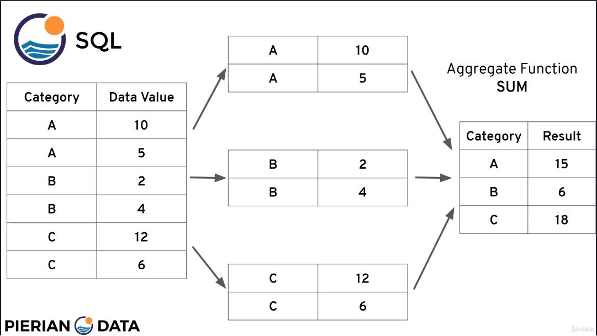
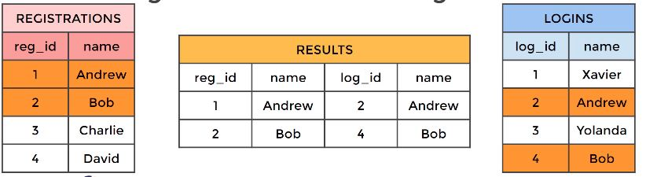
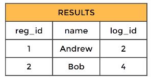
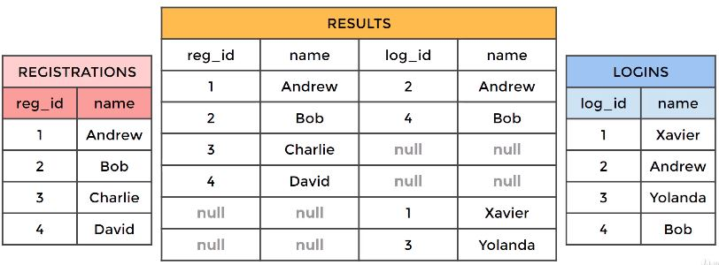
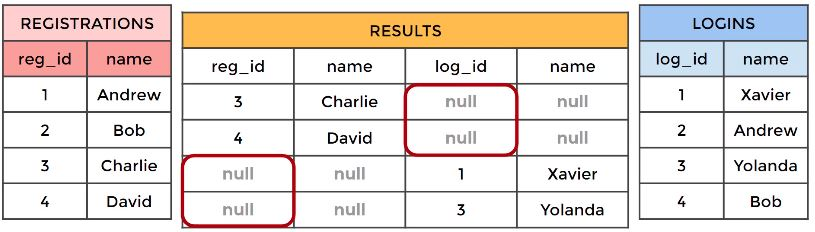
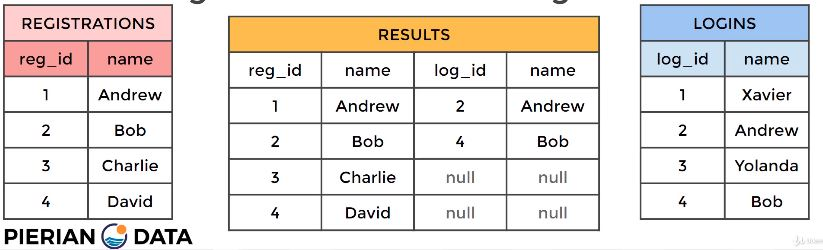
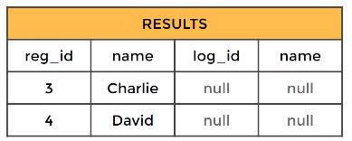
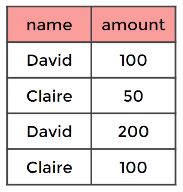

# SQL Reference

## Table of Contents
1. [SQL Compatibility](#sql-compatibility)
2. [Typical Users](#typical-users)
3. [Spreadsheets vs. Databases](#spreadsheets-vs-databases)
4. [SQL Statement Fundamentals](#sql-statement-fundamentals)
   1. [SELECT](#select-statement)
   2. [DISTINCT](#select-distinct)
   3. [COUNT](#count)
   4. [WHERE](#select-where)
   5. [ORDER BY](#order-by)
   6. [LIMIT](#limit)
   7. [BETWEEN](#between)
   8. [IN](#in)
   9. [LIKE, ILIKE](#like-and-ilike)
5. [GROUP BY Statements](#group-by-statements)
   1. [Aggregation Functions](#aggregation-functions)
   2. [GROUP BY](#group-by)
   3. [HAVING](#having)
6. [Joins](#joins)
   1. [AS](#as)
   2. [INNER JOIN](#inner-join)
   3. [FULL OUTER JOIN](#full-outer-join)
   4. [LEFT OUTER JOIN](#left-outer-join)
   5. [RIGHT JOIN](#right-outer-join)
   6. [UNION](#union)
   7. [Multiple JOINs](#multiple-joins)
7. [Advanced SQL Commands](#advanced-sql-commands)
   1. [Timestamps and EXTRACT](#timestamps-and-extract)
   2. [Mathematical Functions and Operators](#mathematical-functions-and-operators)
   3. [String Functions and Operators](#string-functions-and-operators)
   4. [SubQuery](#subquery)
   5. [Self-Join](#self-join)
8. [Creating Databases/Tables](#creating-databases-tables)
9. [Conditional Expressions and Procedures](#conditional-expressions-and-procedures)

*Disclaimer: images and subject matter sourced from Jose Portilla, Pierian Data, "The Complete SQL Bootcamp 2020"*

## SQL Compatibility
SQL can be used with most engines/software/databases that implement SQL (PostgreSQL, MySQL, Amazon RedShift, Microsoft SQL Server, MySQL, Oracle Database). 

PostgreSQL
- Free (open source)
- Widely used on internet
- Multi-platform

MySQL
- Free (open source)
- Widely used on internet
- Multi-platform

MS SQL Server Express
- Free but with some limitations
- Compatible with SQL Server
- Windows only

Microsoft Access
- Cost
- Not easy to use just SQL

SQLite
- Free (open source)
- Mainly command line

## Typical Users
SQL is used to store/retrieve/update/delete data. Databases have a wide variety of users, such as analysts (marketing, business, sales), technical users (data scientists, software engineers, web developers), and basically anyone needing to deal with data. 

## Spreadsheets vs. Databases
Spreadsheets are most useful for one-time analyses, quick charting, reasonable dataset sizes, and those untrained to work with data. Databases are most useful for data integrity, handling (very) large datasets, combining datasets, automating queries, and supporting data for websites and apps. 

## SQL Statement Fundamentals

### SELECT statement
At minimum, selects column/s from table/s. 

Format: `SELECT column_name FROM table_name;`

Specify multiple columns: `SELECT column_1, column_2 FROM table_1;`

Select all columns: `SELECT * FROM table_1;`
- Increases traffic between DB and application, which can slow retrieval of results. 

### SELECT DISTINCT
`DISTINCT` operates on a column to retrieve only **unique** values from a column. 

Format: `SELECT DISTINCT column_name FROM table_name;`. 

Optional to surround column name with parentheses for readability: `SELECT DISTINCT(column_name) FROM table_name;`. 

Example: `SELECT COUNT(DISTINCT(district)) FROM address;`

### COUNT
Returns number of input rows that match specific condition of a query. 

Can apply COUNT on specific column or pass COUNT(*) - both return the same result, since the number of columns in 1 table are always the same. 

Format: `SELECT COUNT(column_name) FROM table_name;` 

or `SELECT COUNT column_name FROM table_name;`

Find the number of rows in a table: `SELECT COUNT(*) FROM table_name;`. 

COUNT is more useful when combined with other commands. 

Format: `SELECT COUNT(DISTINCT name) FROM table;`

or `SELECT COUNT DISTINCT name FROM table;` 

or `SELECT COUNT(DISTINCT(name)) FROM table;`
- Selects the name column from the table
- `DISTINCT name`: filters for unique names
- `COUNT(DISTINCT name`): reduces query to the number of unique names

### SELECT WHERE
Most fundamental combination of a SQL statement. Allows specification of conditions on columns for the rows to be returned. 

Format: `SELECT column_name FROM table WHERE condition/s;`
- WHERE clause must appear immediately after FROM clause.

PostgreSQL provides variety of standard operators to construct the conditions.  

Comparison operators: `<`, `>`, `=`, `>=`, `<=`, `!=`. 

Logical operators allow combination of comparison operators: `AND`, `OR`, `NOT`. 

String/s denoted by single quotation marks, i.e. `SELECT name, choice FROM table WHERE name='Vik' AND choice='Red'`. 

### ORDER BY
Sort rows in columns based on a column value, ascending or descending. 

Format: `SELECT column_name FROM table ORDER BY column_1 ASC / DESC`

ORDER BY will be toward the end of the query, since sorting is ideal after filtering. 

If multiple columns specified to order, each column is prioritized by what was listed first. 

If ASC / DESC left blank, ASC is default. 

Example: `SELECT company, name, sales FROM table_1 ORDER BY company DESC, sales ASC` filters to company, name and sales columns from the table_1. Company column is ordered first by descending alphabetical order. Within each company, sales is ordered next by ascending value. 

### LIMIT
Limit number of rows returned for a query. Also useful in combination with `ORDER BY`. 

Format: `SELECT column_name FROM table WHERE condition ORDER BY column_1 ASC, column_2 DESC LIMIT quantity;`

`LIMIT` goes at the very end of the query, since it's the last command to be executed. 

Example: `SELECT * FROM payment WHERE amount != 0.00 ORDER BY payment_date DESC LIMIT 5;`

### BETWEEN
Can be used to match a value against a range of values. Useful in conjunction with WHERE to add on a numeric range condition. 

Equivalent to `WHERE value>=low AND value<=high`. 

Format: `SELECT column_name FROM table WHERE value BETWEEN low AND high;`

Also useful in conjunction with `NOT` to **exclude** a specified range. Example: `SELECT customer_id FROM payment WHERE customer_id NOT BETWEEN 5 AND 10`. 

Also possible to use the range with ISO 8601 date format (`YYYY-MM-DD`). Example: `BETWEEN '2012-09-21' AND '2016-06-13'`. 

Use caution when using this with dates that also include timestamp information, since datetime starts at 0:00. 

### IN
Can be used to check for multiple possible value options. 

Format: `SELECT column/s from table WHERE column IN (option1, option2);`

Example: `SELECT * from payment WHERE amount IN (0.99, 1.98, 1.99);`

### LIKE and ILIKE
Allows performing pattern matching against string data with the use of wildcard characters. 

`LIKE` matches case-sensitive-wise, and `ILIKE` matches case-insensitive-wise. 

Format: `SELECT column/s from table WHERE column LIKE string`;

Wildcard characters: 
- `%`: matches any sequence (number) of characters
- `_`: matches any single character. Multiple underscores can be used in a query

Example: `SELECT name from employees WHERE name LIKE 'A%';`
- Returns all names that begin with an uppercase A and any number and set of letters that procede it. 

Example: `SELECT animal from creatures WHERE animal ILIKE 'E%';`
- Returns all animals that begin with the letter e, case insensitive. 

Example: `SELECT name from film WHERE name LIKE 'Mission Impossible _';`
- Returns all names that begin with Mission Impossible, but only 1 character can be replaced with `_` (such as the sequel number). 

Example: `SELECT version from programs WHERE version LIKE 'VERSION#__';`
- Returns all versions of programs that have 2 digits in the version number. 

Example: `SELECT COUNT(*) from employees WHERE name LIKE '_her%';`
- Returns the number of all names that contain the letters 'her' with exactly one letter preceding it. 

## GROUP BY Statements

### Aggregation Functions
An aggregate function computes a single result from a set of input values. 

Aggregate function calls occur only in the `SELECT` clause or the `HAVING` clause. 

Most common aggregate functions:
- `AVG(expression)`: returns average
  - Returns floating point value to many decimal places. 
  - Recommended to use `round()` to specify precision after the decimal. 
- `COUNT(expression)`: returns number of values
  - Returns number of rows, which by convention can use `COUNT(*)`. 
- `MAX(expression)`: returns max
- `MIN(expression)`: returns min
- `SUM(expression)`: returns sum 

Example: `SELECT MIN(replacement_cost) FROM film;`

Example: `SELECT MAX(replacement_cost), MIN(replacement_cost) FROM film;`

Example: `SELECT ROUND(AVG(replacement_cost), 2) FROM film;`
- `ROUND()` accepts 2 parameters: the first being a floating point value, and the second being the number of decimal places desired. 

[PostgreSQL docs on aggregate functions](https://www.postgresql.org/docs/current/functions-aggregate.html)

### GROUP BY
Allows aggregation of columns per some category. 

Format: `SELECT category_col, AGG(data_col) FROM table GROUP BY category_col;`

`GROUP BY` must appear immediately after a `FROM` or `WHERE` statement. 

or `SELECT category_col, AGG(data_col) FROM table WHERE condition GROUP BY category_col;`. 

Categorical columns are non-continuous, but can still be numerical (e.g. Class 1, Class 2, Class 3). A categorical column must be chosen to `GROUP BY` with. 

Upon `GROUP BY`, data values associated with redundant categories in categorical columns are separated into tables unique to that specific category. When an aggregate function is performed on these separated tables, a new condensed table is formed that merges the repeated categories. 


*Source: Jose Portilla, Pierian Data Inc.*

In the `SELECT` statement, columns must either have an aggregate function or be in the `GROUP BY` call. 

Example: `SELECT company, division, SUM(sales) FROM finance_table GROUP BY company, division;`
- Returns total sum of sales, per division and per company. 
- The company and division columns are not passed into the aggregate function, and thus must appear in the `GROUP BY` clause. 
- The sales column does not appear in the `GROUP BY` statement, and thus must be passed into the aggregate function. 

`WHERE` statements should not refer to the aggregation result. 

If sorting (`ORDER BY`) is needed based on the aggregate, the entire function must be referenced. 

Example: `SELECT company, SUM(sales) FROM finance_table GROUP BY company ORDER BY SUM(sales);`. 

Example: `SELECT customer_id, staff_id, SUM(amount) from payment WHERE customer_id=341 GROUP BY customer_id, staff_id ORDER BY customer_id;`

Example: `SELECT DATE(payment_date), SUM(amount) FROM payment GROUP BY DATE(payment_date) ORDER BY SUM(amount) DESC;`

### HAVING
Allows using the aggregate result as a filter along with a `GROUP BY` clause. This circumvents the issue of being unable to filter the aggregate via `WHERE`, since aggregation occurs after the `WHERE` clause, and `WHERE` filters non-aggregate properties.

Format: `SELECT column1, AGG(column2) FROM table WHERE condition GROUP BY column1/2 HAVING AGG(column2) [comparative condition];`

Example: `SELECT customer_id, sum(amount) FROM payment GROUP BY customer_id HAVING sum(amount) > 100 ORDER BY customer_id;`
- Returns customers in payment table that have a total amount greater than 100. 

Example: `SELECT store_id, COUNT(*) FROM customer GROUP BY store_id HAVING COUNT(*) > 300;`
- Returns store_id's that have more than 300 rows. 

Example: `SELECT customer_id, COUNT(*) FROM payment GROUP BY customer_id HAVING COUNT(*) >= 40;`
- Returns customers with 40 or more payments. 

Example: `SELECT customer_id, SUM(amount) from payment WHERE staff_id = 2 GROUP BY customer_id HAVING SUM(amount) > 100;`
- Returns customers associated with staff_id 2 whose sum amount is greater than 100. 

## Joins
Allows combination of multiple tables. 

In general, `INNER JOIN`s allow matching between column commonalities between both tables. `OUTER JOIN`s allow specifying how to deal with values present in only one of these tables. 

### AS
Allows creating an alias for a column or result. 

Format: `SELECT column AS new_name FROM table;`

Can also use this on aggregate functions to re-name the column to something more useful. 

Format: `SELECT SUM(column) AS new_name FROM table;`

Example: 
```
SELECT customer_id, COUNT(rental_id) AS all_rentals, SUM(amount) AS TOTAL_payment
FROM payment
GROUP BY customer_id
ORDER BY total_payment DESC;
```
- Returns number of rentals and total payments of each customer, sorted from most to least total payment. 

`AS` is executed at very end of the query, thus cannot use the alias name inside a `WHERE` operator. 

Example (wrong): `SELECT SUM(payment) AS total_payment FROM table WHERE total_payment > 100;`

Example (correct): `SELECT SUM(payment) AS total_payment FROM table WHERE SUM(payment) > 100;`

### INNER JOIN
Results in the set of records that match in **both** tables. Joined table is joined `ON` the specified column match between both tables. 

Format: `SELECT * FROM table1 INNER JOIN table2 ON table1.col_match = table2.col_match;`

Since the column names are identical, must specify what table the column is referring to in the `ON` clause, via `table1.col_match = table2.col_match`. 

If only `JOIN` written in query, PostgreSQL defaults to `INNER JOIN`. 

Format: `SELECT * FROM table1 JOIN table2 ON table1.col_match = table2.col_match;`

With `INNER JOIN`, the column commonality between both tables allows switching table references in the query. 

Format: `SELECT * FROM table2 INNER JOIN table1 ON table1.col_match = table2.col_match;`

Example: `SELECT * FROM Registrations INNER JOIN Logins ON Registrations.name = Logins.name;`



To remove redundancy of matched columns appearing more than once, specify the columns to be shown exactly once as part of the `SELECT` clause. 

Example: `SELECT reg_id, Logins.name, log_id FROM Registrations INNER JOIN Logins ON Registrations.name = Logins.name;`



Non-redundant column names do not necessitate referencing the table it is from. 

Example: `SELECT payment.customer_id, payment_id, first_name FROM payment INNER JOIN customer ON payment.customer_id = customer.customer_id;`
- `payment_id` and `first_name` columns are unique to their respective tables, while `customer_id` is in both tables. 

### FULL OUTER JOIN
Selects all information from both tables. 

Format: `SELECT * FROM table1 FULL OUTER JOIN table2 ON table1.col_match = table2.col_match;`

The joined table includes column commonality from the `ON` condition, unique information to table1, and unique information to table 2. Table areas adjacent to the unique information from each table are filled with `null`. 

Example: `SELECT * FROM Registrations FULL OUTER JOIN Logins ON Registrations.name = Logins.name;`



To return only rows unique to each table, specify a condition in a `WHERE` clause. Essentially a filtered `FULL OUTER JOIN`. 

Format: 
```
SELECT * FROM table2
FULL OUTER JOIN table1
ON table1.col_match = table2.col_match
WHERE table1.id IS null OR 
table2.id IS null;
```

Example: 
```
SELECT * FROM Registrations
FULL OUTER JOIN Logins
ON Registrations.name = Logins.name
WHERE Registrations.reg_id IS null OR
Logins.log_id IS null;
```



Example: 
```
SELECT * from customer
FULL OUTER JOIN payment
ON customer.customer_id = payment.customer_id
WHERE customer.customer_id IS null
OR payment_id IS null
```
- Returns a joined customer/payment table on customer id where the customer id or payment id do not exist. Ensures customer information (email, name, etc.) are stored only if payment or purchsae history exists for that customer. 

### LEFT (OUTER) JOIN
Results in set of records that are in the 'left' table; includes all left table results and commonalities between left and right table. If there is no match with the right table, results are `null`. 

Format: `SELECT * FROM table1 LEFT OUTER JOIN table2 ON table1.col_match = table2.col_match;`

or 

Format: `SELECT * FROM table1 LEFT JOIN table2 ON table1.col_match = table2.col_match;`

Example: `SELECT * FROM Registrations LEFT JOIN Logins ON Registrations.name = Logins.name;`



To return results **exclusive** to the left table, specify a condition in `WHERE` that accounts for the right table join results being `null`. 

Format: `SELECT * FROM table1 LEFT JOIN table2 ON table1.col_match = table2.col_match WHERE table2.id IS null;`

Example: `SELECT * FROM Registrations LEFT OUTER JOIN Logins ON Registrations.name = Logins.name WHERE Logins.log_id IS null;`



Example: 
```
SELECT film.film_id, title, inventory_id, store_id
FROM film
LEFT JOIN inventory 
ON inventory.film_id = film.film_id
WHERE inventory.film_id IS null;
```
- Lists film titles and their ids that are not in inventory. 

### RIGHT (OUTER) JOIN
Returns all results of the right table including commonalities with the left table. The same as a LEFT JOIN, except switched for the right table. 

Format: `SELECT * FROM table1 RIGHT OUTER JOIN table2 ON table1.col_match = table2.col_match;`
- Equivalent to `SELECT * FROM table2 LEFT OUTER JOIN table1 ON table1.col_match = table2.col_match;`.

### UNION
Used to combine the result-set of two or more SELECT statements. Concatenates, or literally merges, two resultant tables together - independent of column commonality. 

Format: `SELECT column_name(s) FROM table1 UNION SELECT column_name(s) FROM table2;`

Example: `SELECT * FROM Sales2021_Q1 UNION SELECT * FROM Sales2021_Q2;`



### Multiple JOINs
If more than 2 tables are involved in a query, use at least 2 joins to obtain the desired results. 

Example: 
```
SELECT title, first_name, last_name FROM film
JOIN film_actor
ON film.film_id = film_actor.film_id
JOIN actor
ON film_actor.actor_id = actor.actor_id
WHERE first_name = 'Nick' AND last_name = 'Wahlberg';
```
- Returns all movies in which 'Nick Wahlberg' is an actor. `actor` table includes actor `first_name`s, `last_name`s, and `actor_id`s. `film` includes film information, including `film_id`. `film_actor` includes `actor_id` and associated `film_id`s. Since 3 tables are needed to obtain the requested information on the 2 commonalities of `film_id` and `actor_id`, 2 `INNER JOIN`s are required. 

## Advanced SQL Commands

### Timestamps and EXTRACT
SQL queries and tables can handle date and time information. [Datetime Functions, PostgreSQL](https://www.postgresql.org/docs/8.3/functions-datetime.html)
- `TIME`: contains only time
- `DATE`: contains only date
- `TIMESTAMP`: contains date and time
- `TIMESTAMPTZ`: contains date, time, and timezone

Caution: it is possible to remove information from datetime information, but not add. 

`SHOW ALL;`: Command and parameter that list all possible parameters. 

`SELECT NOW();` : Provides current date and time in `timestamp with time zone` format. Example: `2020-07-20 21:13:30.134498-07`

`SELECT TIMEOFDAY();` : Provides current date and time in `text` format. May be preferred over `SELECT NOW();` for better intelligibility. Example: `Mon Jul 20 21:13:14.860518 2020 PDT`

`SELECT CURRENT_TIME;` : Provides current time in `time with time zone` format. Example: `21:12:28.542536-07:00`

`SELECT CURRENT_DATE;` : Provides current date in `date` format. Example: `2020-07-20`

It is possible to extract infomration from time-based data type with the following functions: 
- `EXTRACT()` : allows extraction of a sub-component of a date value using the field parameters `YEAR`, `MONTH`, `DAY`, `WEEK`, `QUARTER`, `DOW`, `DECADE`, etc. 
  - Format: `EXTRACT(YEAR FROM date_col);`
  - Example: `SELECT EXTRACT(YEAR FROM payment_date) AS year FROM payment;`
    - Returns the year in each column and names the column as `year`. 
  - Example: `SELECT COUNT(*) FROM payment WHERE EXTRACT(DOW FROM payment_date) = 1;` 
    - Returns the number of payments made on a Monday (Sunday = 0, Saturday = 6). 
- `AGE()` : calculates and returns current age given a timestamp recorded in the database. 
  - Format: `AGE(date_col);`
  - Example return: `13 years 1 mon 5 days 01:35:13.003423`
- `TO_CHAR()` : general function to convert data types to text. Especially useful for timestamp formatting. [TO_CHAR, PostgreSQL](https://www.postgresql.org/docs/12/functions-formatting.html)
  - Format: `TO_CHAR(date_col, string_format);`
  - Example: `SELECT TO_CHAR(payment_date, 'MONTH-YYYY') FROM payment;`
    - Returns date as `MONTH-YYYY`. 
  - Example: `SELECT TO_CHAR(payment_date, 'mon/dd/YYYY') FROM payment;`
  - Example: `SELECT DISTINCT(TO_CHAR(payment_date, 'MONTH')) FROM payment;`
    - Returns unique months that payments were made in. 

### Mathematical Functions and Operators
Perform mathematical functions and use operators between columns in a table. [Mathematical Functions and Operators Docs, PostgreSQL](https://www.postgresql.org/docs/9.5/functions-math.html)

Example: `SELECT ROUND(rental_rate/replacement_cost)*100 FROM film;`
- Returns result of dividing `rental_rate` by `replacement` to 2 places, multiplied by 100 to obtain percentage. 
Example: `SELECT 0.1 * replacement_cost AS deposit FROM film;`
- Returns 10% of replacement costs. 

### String Functions and Operators
Perform functions and use operators on String types. [String functions and Operators, PostgreSQL](https://www.postgresql.org/docs/current/functions-string.html)


### SubQuery

### Self-Join

## Creating Databases/Tables

## Conditional Expressions and Procedures
